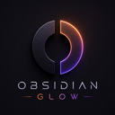
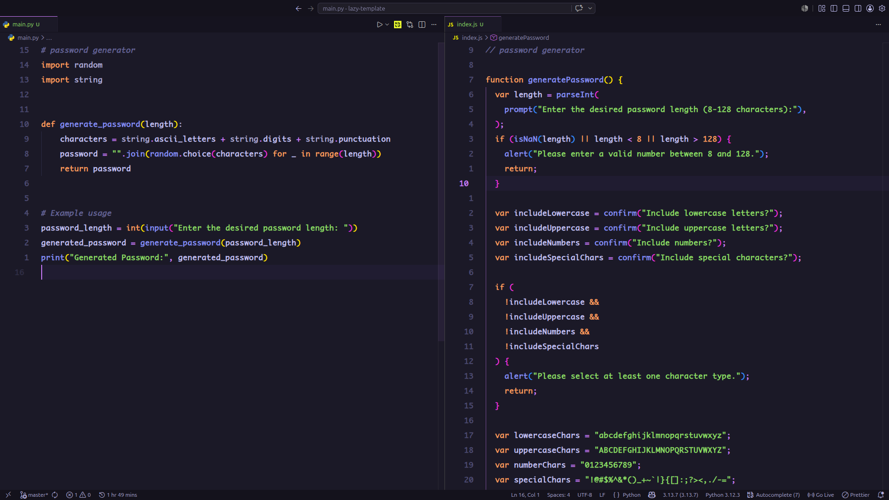
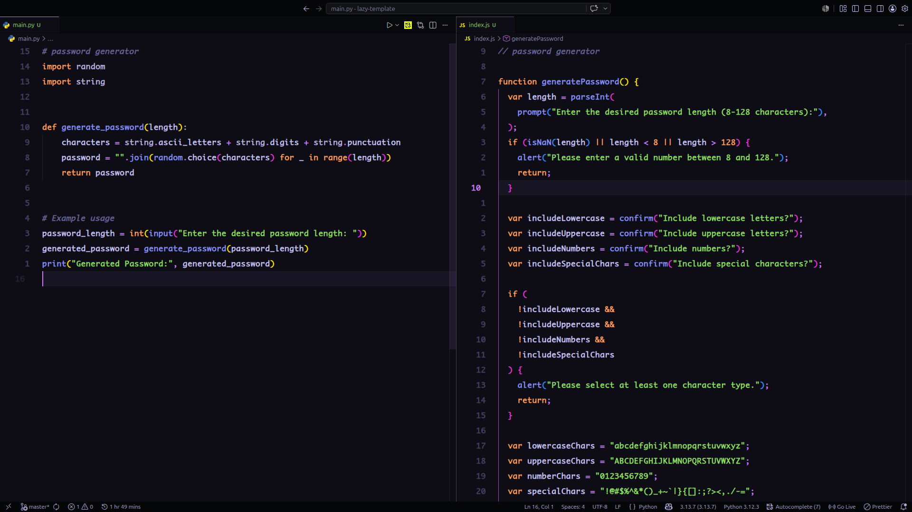
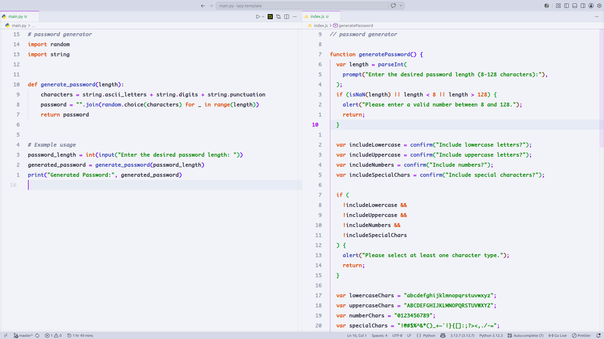
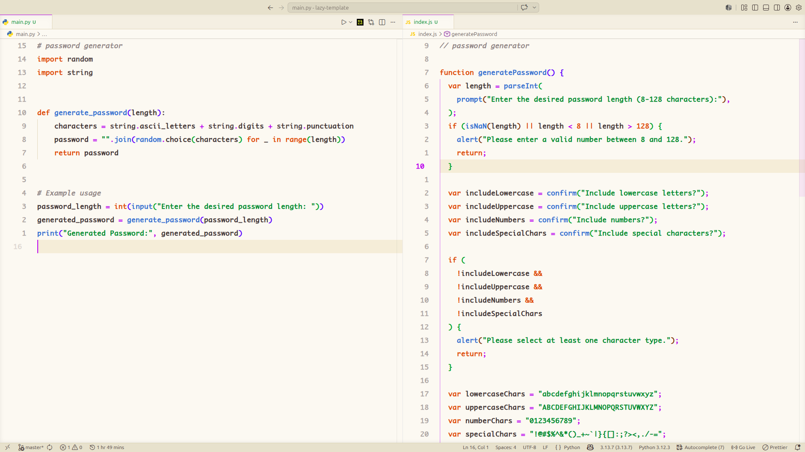

# Obsidian Glow

<p align="center">
  
</p>

A minimal luxury coding aesthetic inspired by modern automotive dashboards and glowing ambient cockpit lighting. Designed and developed by **[0xRasla](https://github.com/0xRasla)**.

---

## 🚦 Theme Variations

Obsidian Glow is available in **four** distinct cockpit styles:

1. **Obsidian Glow (Default)**
   - The signature midnight luxury dashboard. Deep carbon slate backgrounds (`#1a1b26`) paired with digital tachometer colors and an electric lavender ambient LED strip (`#bb9af7`).
2. **Obsidian Glow - Carbon OLED**
   - Pure, unlit deep-space cockpit. The carbon backing is dropped to pitch black (`#0d0e15`), causing the dashboard elements and the lavender accent strip to shine with high-brilliance intensity.
3. **Obsidian Glow - Ambient Light**
   - Luxurious silver-metallic daytime cockpit. Clean brushed-silver backings (`#f2f4f8`), charcoal-slate instruments (`#383a47`), and an active daytime orchid purple ambient highlight (`#8f58e8`).
4. **Obsidian Glow - Sunset Sand**
   - The warm leather cockpit variation. Cream ivory/beige dashboard background (`#fcf8f2`), warm espresso-charcoal text (`#4a3e3d`), and sunset amber gauges (`#d35400`) backlit by a gold-orchid LED trim (`#a55eea`).

---

## 🛠️ Development & Packaging

This project is configured with **Bun** for fast execution.

```bash
# Install dependencies
bun install

# Real-time preview: Press F5 inside VS Code to launch the Extension Development Host.

# Package for Marketplace
bunx vsce package --no-dependencies
```

---

## 📷 Previews & Syntax Examples

### Obsidian Glow (Default Dark Carbon)


### Obsidian Glow - Carbon OLED (Pitch Black)


### Obsidian Glow - Ambient Light (Sleek Silver Day)


### Obsidian Glow - Sunset Sand (Warm Ivory Day)


---

## 👤 Author & Credits
Created with ❤️ by **[0xRasla](https://github.com/0xRasla)**. 
- GitHub: [@0xRasla](https://github.com/0xRasla)
